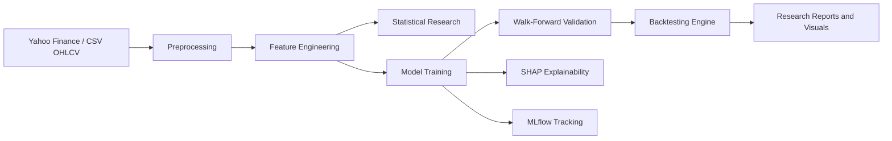
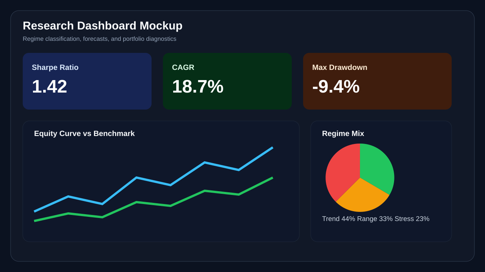

# QuantResearchSystem

Research-grade quantitative research platform for **market regime detection and adaptive machine learning strategies**. The repository is now structured as a modular research infrastructure project rather than a tutorial-style prototype, with reproducible experiment workflows, realistic backtesting, statistical diagnostics, explainability hooks, and production-minded Python packaging.


## Why This Project Exists

Financial markets are non-stationary. Models that ignore regime shifts usually decay fast in live settings. This platform is designed to study:

- how to detect market regimes from OHLCV data and engineered features
- how different model classes behave across shifting regimes
- how predictive performance translates into realistic trading outcomes
- how to make quant research reproducible, explainable, and extensible

This is the kind of repository framing expected from a serious AI/quant research candidate targeting competitive internships and research programs such as CERN, OIST, Mitacs, and ETH Zurich.

## Research Scope

The platform covers:

- Financial data ingestion from Yahoo Finance and local CSV files
- OHLCV preprocessing and reproducible dataset preparation
- Feature engineering with RSI, MACD, Bollinger Bands, volatility, momentum, and lag features
- Statistical research modules for stationarity, correlation, cointegration, and volatility analysis
- Forecasting and regime-aware modeling interfaces for:
  - Random Forest
  - XGBoost
  - LSTM
  - GRU
  - Transformer forecasting
- Reinforcement learning portfolio optimization interfaces for PPO and DQN-style workflows
- Walk-forward validation and model comparison
- Realistic backtesting with transaction costs, slippage, Sharpe ratio, drawdown, CAGR, and turnover
- Plotly/Matplotlib-ready visualization hooks
- SHAP explainability hooks
- MLflow experiment tracking
- Documentation, reporting templates, and experiment configs

## Repository Structure

```text
QuantResearchSystem/
|-- src/quantresearch/
|   |-- backtesting/       # realistic trading simulation and risk metrics
|   |-- data/              # Yahoo Finance, CSV ingestion, OHLCV preprocessing
|   |-- evaluation/        # walk-forward validation and model metrics
|   |-- explainability/    # SHAP-based feature attribution hooks
|   |-- features/          # technical indicators and lag feature engineering
|   |-- models/            # tree, deep learning, transformer, and RL interfaces
|   |-- pipelines/         # end-to-end regime research orchestration
|   |-- research/          # statistical diagnostics and hypothesis-testing helpers
|   |-- tracking/          # MLflow experiment tracking helpers
|   `-- visualization/     # Plotly research visuals
|-- configs/
|   |-- base.yaml
|   `-- experiments/       # reproducible experiment definitions
|-- workflows/             # experiment runners and model comparison scripts
|-- docs/
|   |-- architecture.md
|   |-- methodology.md
|   |-- roadmap.md
|   |-- research_report_template.md
|   `-- assets/            # architecture + dashboard visuals
|-- tests/                 # quant research unit tests
|-- backend/               # legacy service layer retained from earlier platform iteration
|-- frontend/              # legacy frontend retained for future integration
`-- pyproject.toml         # Python 3.11 package definition and optional extras
```

## Architecture



## Methodology

1. Ingest OHLCV market data from Yahoo Finance or curated CSV datasets.
2. Normalize time indices, clean missing values, and compute return targets.
3. Engineer technical and lag-based features.
4. Infer coarse market states such as `trend`, `range`, and `stress`.
5. Run statistical diagnostics to validate stationarity and dependency structure.
6. Train models under walk-forward validation.
7. Convert forecasts into trading signals.
8. Simulate execution with transaction costs and slippage.
9. Compare both forecast metrics and portfolio-quality metrics.

## Implemented Core Modules

### 1. Data Pipeline

- `src/quantresearch/data/ingestion.py`
- `src/quantresearch/data/preprocessing.py`

Capabilities:

- Yahoo Finance ingestion through an optional extra
- CSV import for offline reproducibility
- standardized OHLCV normalization
- target-return generation for forecasting research

### 2. Feature Engineering

- `src/quantresearch/features/technical.py`

Implemented features:

- RSI(14)
- EMA(12), EMA(26)
- MACD and MACD signal
- Bollinger Bands
- annualized rolling volatility
- 5-day and 21-day momentum
- lagged returns and lagged volume
- simple regime labels for baseline research

### 3. Statistical Research

- `src/quantresearch/research/statistics.py`

Implemented diagnostics:

- Augmented Dickey-Fuller stationarity test
- close/return correlation analysis
- realized volatility
- cointegration testing against a benchmark series

### 4. Models

- `src/quantresearch/models/traditional.py`
- `src/quantresearch/models/deep_learning.py`
- `src/quantresearch/models/reinforcement.py`

Current status:

- Random Forest is implemented as a working baseline
- XGBoost is exposed through an optional dependency
- LSTM, GRU, and Transformer are scaffolded with research-friendly interfaces and optional Torch dependency checks
- RL portfolio optimization is exposed through an optional interface designed for Stable-Baselines3/Gymnasium integration

### 5. Validation, Backtesting, and Metrics

- `src/quantresearch/evaluation/walk_forward.py`
- `src/quantresearch/backtesting/engine.py`
- `src/quantresearch/evaluation/metrics.py`

Implemented evaluation stack:

- rolling walk-forward validation
- MAE and RMSE forecast metrics
- transaction costs and slippage
- Sharpe ratio
- max drawdown
- CAGR
- turnover

### 6. Tracking and Explainability

- `src/quantresearch/tracking/mlflow_tracker.py`
- `src/quantresearch/explainability/shapley.py`

These modules use graceful optional imports so the repository remains installable in lightweight environments while still supporting full research workflows.

## Example Workflows

### Install

Lightweight core:

```bash
python -m pip install -e .
```

Full research stack:

```bash
python -m pip install -e .[full]
```

### Run an Experiment

```bash
python workflows/run_regime_experiment.py --config configs/experiments/regime_rf.yaml
```

Offline sample run with no Yahoo Finance dependency:

```bash
python workflows/run_regime_experiment.py --config configs/experiments/regime_offline_sample.yaml
```

### Compare Models

Use `workflows/compare_models.py` from a notebook or a small driver script to compare baseline models on the same engineered dataset.

### Run Tests

```bash
pytest tests/test_feature_engineering.py tests/test_backtest_engine.py tests/test_walk_forward.py tests/test_regime_pipeline.py
```

## Experiment Configs

Available example configs:

- `configs/experiments/regime_rf.yaml`
- `configs/experiments/regime_offline_sample.yaml`
- `configs/experiments/regime_transformer.yaml`
- `configs/experiments/portfolio_rl.yaml`

These define:

- dataset universe and date range
- model family
- forecast horizon and sequence settings
- benchmark symbol
- artifact destination

## Screenshots and Visual Assets

Research presentation assets are included under `docs/assets/`:

- `platform-overview.svg` shows the high-level system architecture
- `research-dashboard.svg` shows a polished dashboard mockup suitable for portfolio presentation

Dashboard mockup preview:



## Metrics to Report in Research Runs

- Forecasting: `MAE`, `RMSE`
- Trading: `Sharpe Ratio`, `CAGR`, `Max Drawdown`, `Turnover`, `Cumulative Return`
- Statistical diagnostics: `ADF p-value`, `Realized Volatility`, `Cointegration p-value`
- Explainability: `mean_abs_shap`

## Research Deliverables

The repository now includes the foundations for professional outputs:

- architecture documentation
- methodology notes
- a research report template
- reproducible YAML experiment configs
- model comparison workflow hooks
- testable Python modules with type hints

## Current Limitations

This upgrade intentionally delivers a strong infrastructure baseline first. A few advanced components are exposed as research interfaces and optional extras rather than heavy mandatory implementations:

- full PyTorch training loops for LSTM/GRU/Transformer
- complete RL training environments and portfolio reward shaping
- frontend integration of the new quant research core
- automated PDF research report generation

Those are documented in [docs/roadmap.md](docs/roadmap.md) and can be built next without restructuring the repository again.

## Documentation

- [Architecture](docs/architecture.md)
- [Methodology](docs/methodology.md)
- [Roadmap](docs/roadmap.md)
- [Research Report Template](docs/research_report_template.md)

## Testing

Targeted tests validate:

- feature engineering outputs
- backtesting mechanics
- walk-forward validation
- end-to-end regime research pipeline execution

## Positioning

This project now presents itself as a **modular quant research infrastructure repository** with clear separation between:

- data engineering
- statistical analysis
- model experimentation
- risk-aware evaluation
- experiment tracking
- research communication

That is a much stronger signal for research internships than a beginner dashboard or single-model demo.
