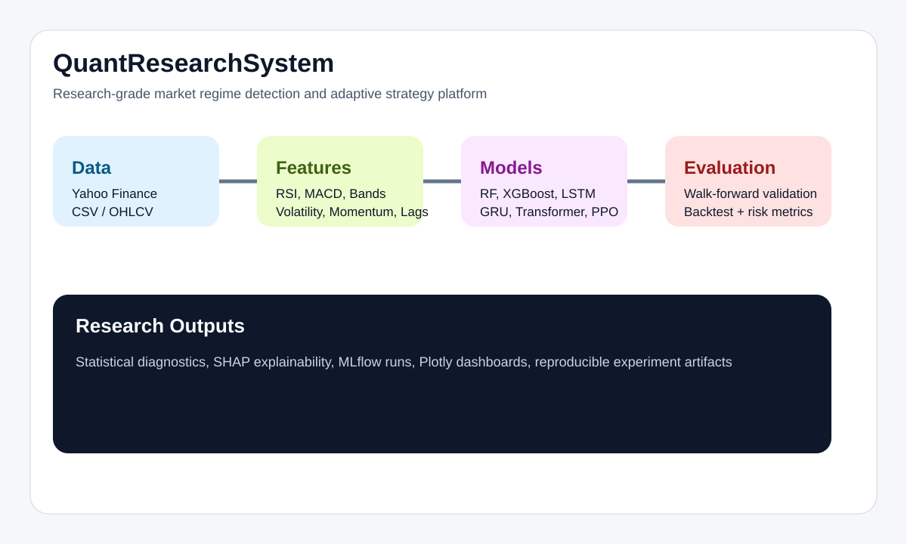
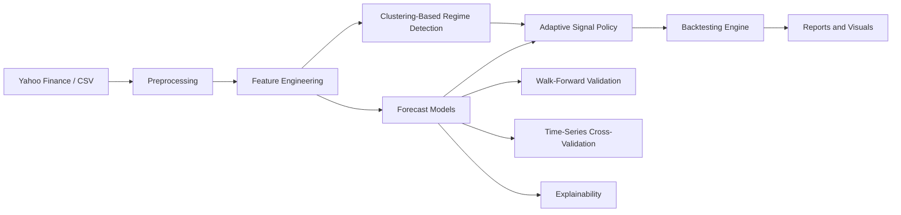
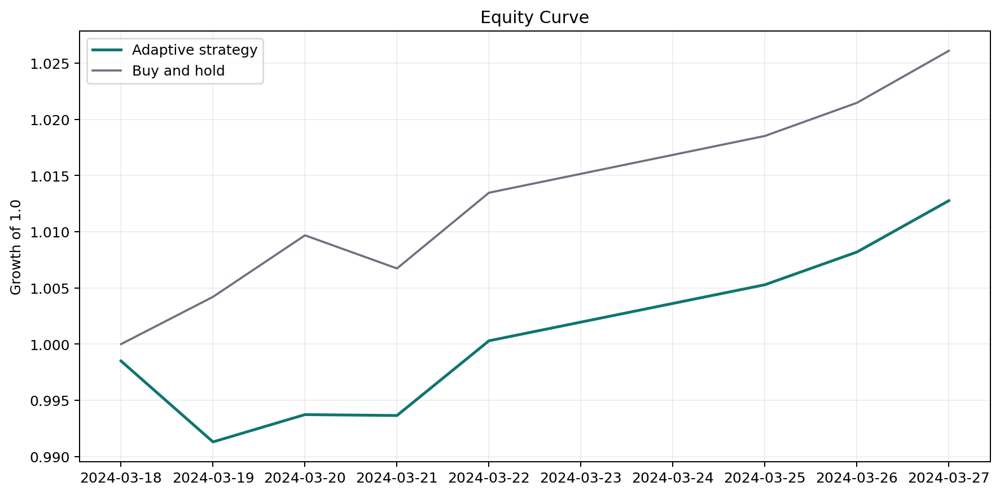
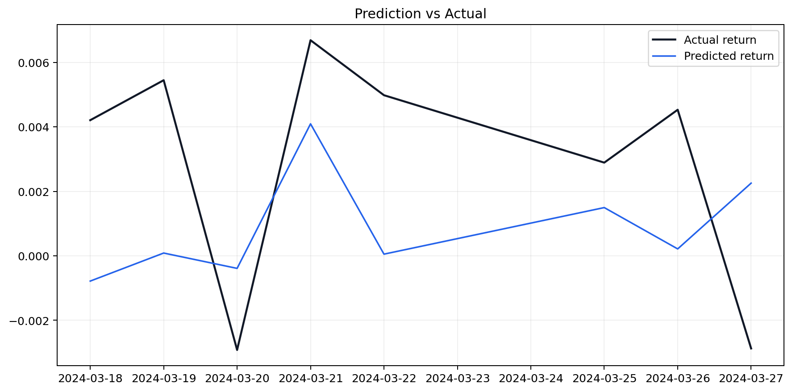
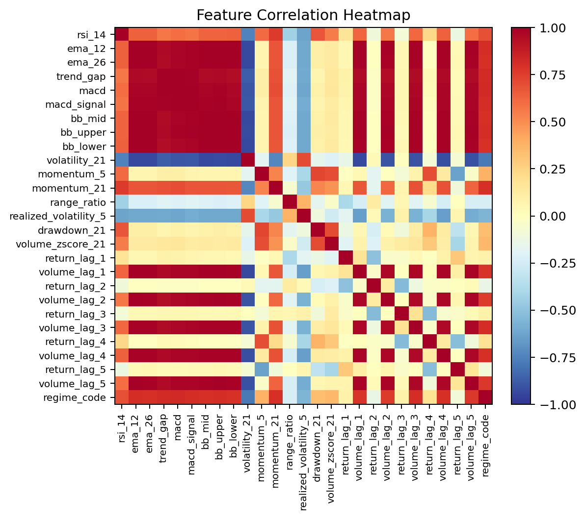
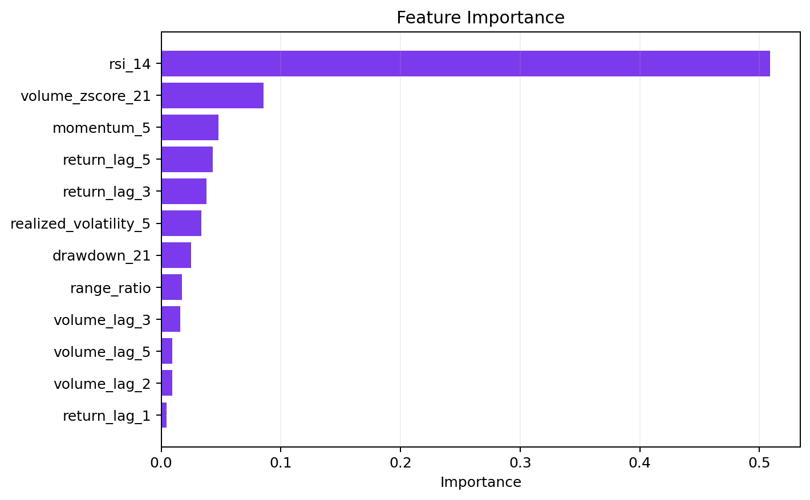
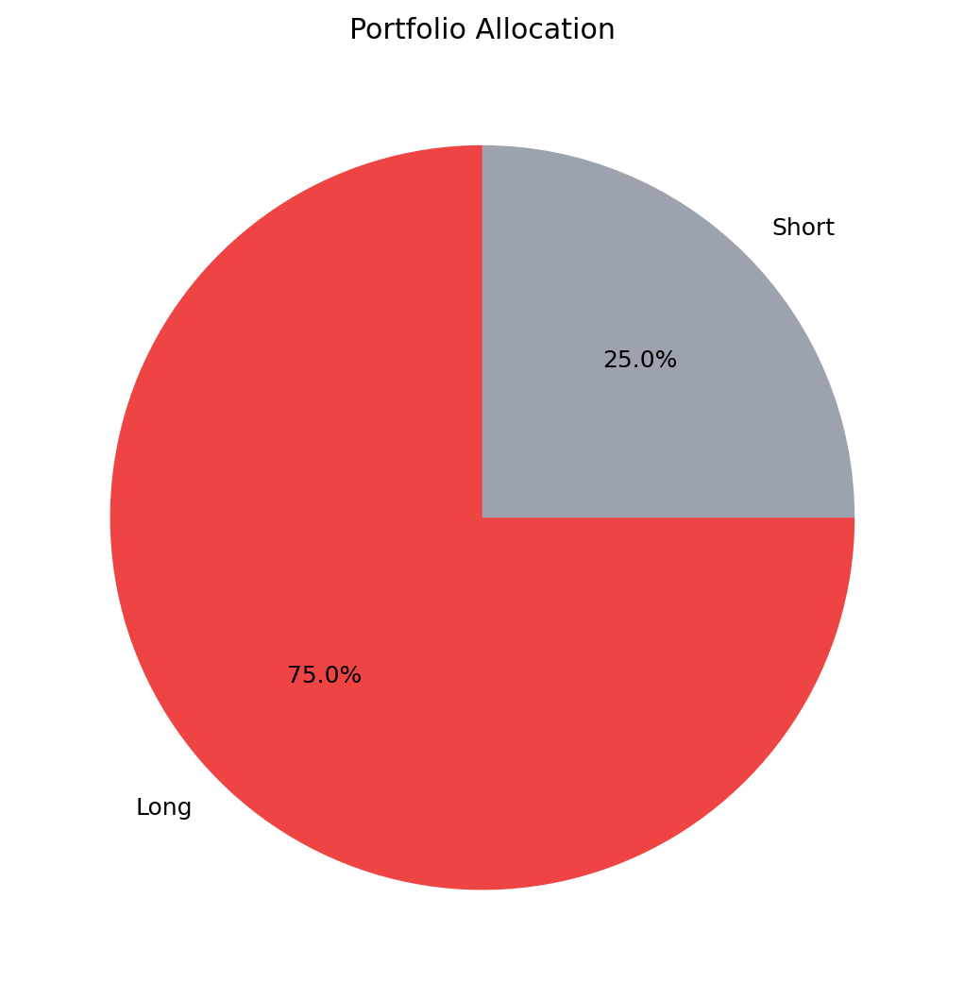
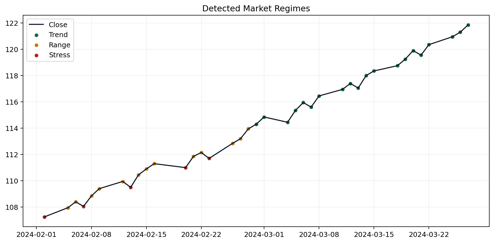

# QuantResearchSystem

QuantResearchSystem is a research-grade quantitative research portfolio project focused on one clear question:

**Can market regime detection improve forecasting quality and trading robustness across changing market conditions?**

The repository keeps its existing modular structure and upgrades it with a stronger research workflow, measurable backtesting outputs, model comparison artifacts, explainability, and portfolio-quality visuals.



## Project Vision

The goal is not to be a generic finance dashboard or a boilerplate ML repo. The goal is to look and behave like a serious quant research platform:

- detect changing market regimes from engineered market features
- adapt strategy behavior by regime instead of assuming one static market
- compare model families under walk-forward validation and time-series cross-validation
- measure outcomes with trading metrics, not just forecast error
- produce reusable reports, charts, and experiment evidence

## Flagship Workflow

### Market Regime Detection + Adaptive ML Strategy

The flagship workflow lives in [`src/quantresearch/pipelines/regime_pipeline.py`](src/quantresearch/pipelines/regime_pipeline.py) and [`workflows/run_regime_experiment.py`](workflows/run_regime_experiment.py).

It performs:

1. OHLCV ingestion from Yahoo Finance or local CSV.
2. Feature engineering with RSI, MACD, Bollinger Bands, momentum, drawdown, volatility, and lagged signals.
3. Unsupervised regime detection with clustering on volatility, momentum, and trend features.
4. Forecasting with one of several model families.
5. Walk-forward validation and time-series cross-validation.
6. Adaptive signal generation by regime:
   trend -> follow prediction direction
   range -> half-size contrarian stance
   stress -> move to cash
7. Backtesting with transaction costs and slippage.
8. Explainability and report generation.

## Research Architecture



## What Changed

- Added clustering-based market regime detection with labeled `trend`, `range`, and `stress` states.
- Upgraded the research pipeline to include walk-forward validation plus time-series cross-validation.
- Added an adaptive strategy layer that changes behavior by detected regime.
- Expanded evaluation metrics to include Sharpe ratio, Sortino ratio, max drawdown, CAGR, volatility, and win rate.
- Added experiment report generation, model comparison report generation, and backtesting report generation.
- Added professional research visualizations as exportable artifacts.
- Added explainability outputs via SHAP when available and permutation/native importance when running in lightweight environments.
- Added an offline sample experiment that produces evidence the repo can showcase immediately.

## Model Experiments

The comparison workflow now benchmarks:

- Random Forest
- XGBoost
- LSTM
- Transformer

Run the comparison directly through the main experiment workflow or through [`workflows/compare_models.py`](workflows/compare_models.py).

### Sample Offline Comparison

Source: `datasets/sample_market_ohlcv.csv`  
Artifacts: [`artifacts/offline_sample_random_forest/`](artifacts/offline_sample_random_forest/)

| Model | MAE | RMSE | Directional Accuracy | Sharpe | CAGR | Win Rate |
| --- | ---: | ---: | ---: | ---: | ---: | ---: |
| Random Forest | 0.0039 | 0.0042 | 0.7500 | 5.6952 | 0.4912 | 0.6250 |
| LSTM | 0.0379 | 0.0476 | 0.6250 | -0.7327 | -0.0596 | 0.5000 |
| Transformer | 0.1598 | 0.2036 | 0.7500 | -0.8803 | -0.0639 | 0.5000 |
| XGBoost | 0.0046 | 0.0053 | 0.3750 | -11.2622 | -0.5195 | 0.1250 |

On the current offline sample, the Random Forest baseline is the strongest overall model and is the default showcase experiment.

## Measurable Results

### Offline Flagship Experiment

Experiment: `offline_sample_random_forest`  
Summary: [`artifacts/offline_sample_random_forest/summary.json`](artifacts/offline_sample_random_forest/summary.json)

- Walk-forward MAE: `0.003907`
- Walk-forward RMSE: `0.004154`
- Directional accuracy: `75.00%`
- Sharpe ratio: `5.6952`
- Sortino ratio: `10.0359`
- Max drawdown: `-0.72%`
- CAGR: `49.12%`
- Volatility: `7.06%`
- Win rate: `62.50%`

### Regime-Level Diagnostic Performance

Source: [`artifacts/offline_sample_random_forest/regime_performance.csv`](artifacts/offline_sample_random_forest/regime_performance.csv)

| Regime | Sharpe | CAGR | Win Rate | Observations |
| --- | ---: | ---: | ---: | ---: |
| Trend | 16.1752 | 1.2885 | 0.8500 | 20 |
| Stress | -4.8831 | -0.1308 | 0.4000 | 5 |
| Range | -22.7325 | -0.3895 | 0.0000 | 13 |

This is exactly the kind of evidence the project should surface: the adaptive strategy behaves very differently across market states, and the regime segmentation makes that visible.

## Visual Outputs

All generated from the offline research run:

### Equity Curve



### Prediction vs Actual



### Correlation Heatmap



### Feature Importance



### Portfolio Allocation



### Market Regimes



## Explainability

Explainability is handled in [`src/quantresearch/explainability/shapley.py`](src/quantresearch/explainability/shapley.py).

- Uses SHAP when the optional dependency is installed.
- Falls back to permutation importance or native feature importance in lightweight environments.
- Exports tabular feature importance and a portfolio-ready chart.

Current offline sample outputs suggest the strongest explanatory drivers include:

- `rsi_14`
- `volume_zscore_21`
- `momentum_5`
- lagged returns
- short-horizon realized volatility

## Example Reports

Generated examples are committed under [`artifacts/offline_sample_random_forest/`](artifacts/offline_sample_random_forest/):

- [Experiment report](artifacts/offline_sample_random_forest/experiment_report.md)
- [Model comparison report](artifacts/offline_sample_random_forest/model_comparison_report.md)
- [Backtesting report](artifacts/offline_sample_random_forest/backtesting_report.md)

These reports provide:

- forecast metrics
- cross-validation diagnostics
- regime summaries
- backtesting metrics
- feature importance summaries

## Repository Structure

```text
QuantResearchSystem/
|-- src/quantresearch/
|   |-- backtesting/
|   |-- data/
|   |-- evaluation/
|   |-- explainability/
|   |-- features/
|   |-- models/
|   |-- pipelines/
|   |-- research/
|   |-- tracking/
|   `-- visualization/
|-- configs/experiments/
|-- workflows/
|-- tests/
|-- docs/
|-- datasets/
`-- artifacts/offline_sample_random_forest/
```

## Usage

### Install Core Dependencies

```bash
python -m pip install -e .
```

### Install Full Research Extras

```bash
python -m pip install -e .[full]
```

### Run the Offline Portfolio Experiment

```bash
python workflows/run_regime_experiment.py --config configs/experiments/regime_offline_sample.yaml
```

### Run a Yahoo Finance Experiment

```bash
python workflows/run_regime_experiment.py --config configs/experiments/regime_rf.yaml
```

### Compare Models Programmatically

```python
from pathlib import Path
import pandas as pd
from workflows.compare_models import compare_models

frame = pd.read_csv("datasets/sample_market_ohlcv.csv", parse_dates=["date"]).set_index("date")
comparison = compare_models(frame)
print(comparison)
```

### Run Focused Tests

```bash
python -m pytest tests/test_feature_engineering.py tests/test_walk_forward.py tests/test_backtest_engine.py tests/test_regime_pipeline.py
```

## Documentation

- [Architecture](docs/architecture.md)
- [Methodology](docs/methodology.md)
- [Roadmap](docs/roadmap.md)
- [Research report template](docs/research_report_template.md)

## Notes on Optional Dependencies

To keep the repository runnable in lightweight environments:

- XGBoost falls back to a scikit-learn gradient boosting backend when `xgboost` is unavailable.
- LSTM and Transformer fall back to lightweight MLP-based surrogates when `torch` is unavailable.
- SHAP falls back to permutation or native importance when `shap` is unavailable.

That means the repository can always produce working research artifacts locally, while still supporting heavier production-grade stacks when optional dependencies are installed.

## Roadmap

Near-term roadmap:

- replace lightweight LSTM/Transformer fallbacks with full Torch training loops
- add HMM-based regime detection alongside clustering
- extend multi-asset portfolio allocation experiments
- add richer benchmark comparisons and factor baselines
- export polished HTML or PDF research reports
- connect the research core back into the existing frontend

## Why This Has Strong Internship Value

This project now demonstrates:

- quantitative research framing rather than generic ML app building
- time-series validation discipline
- regime-aware strategy design
- backtesting and risk evaluation
- explainability and reporting
- reproducible experiment artifacts

That combination is much stronger for research internships than a repo that only shows model code or UI polish.
