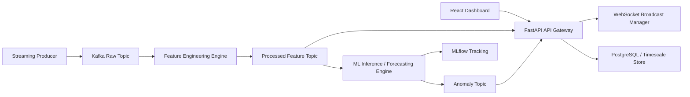

# Architecture

## Design notes
- The backend is the control plane and observability surface.
- Streaming and ML components are independently deployable workers.
- Data validation is enforced at API boundaries with Pydantic schemas.
- Feature engineering uses vectorized operations to preserve scientific reproducibility.
